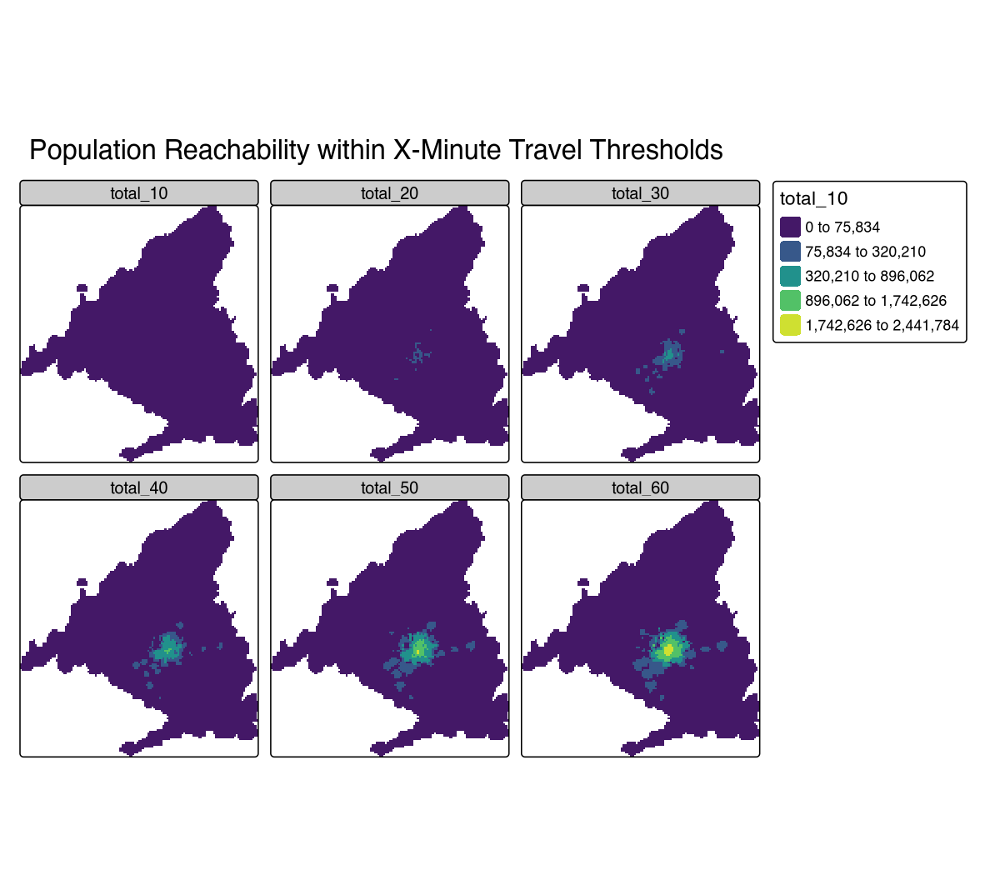
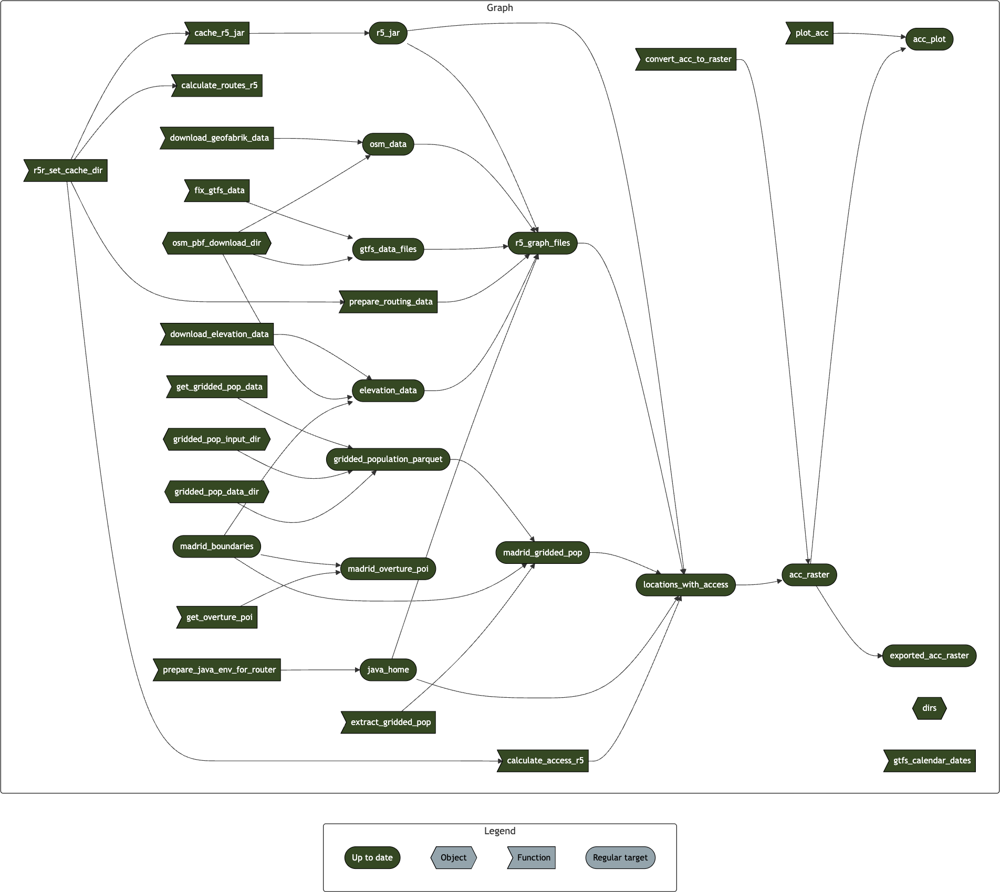

# Accessibility Analysis for Madrid FUA


This repository contains the code to reproduce the accessibility
analysis for Madrid functional urban area (FUA).

Accessibility is measured as the number of people (total, males or
females) that can reach a given location within X minutes by public
transport. You can download the the final accessibility raster
[`outputs/raster/acc_raster.tif`](outputs/raster/acc_raster.tif) and see
the plots below for the results.

[](outputs/plots/main/reachability_total.png)

[](outputs/plots/main/reachability_females.png)

[](outputs/plots/main/reachability_males.png)

Data sources and tools used in the analysis:

- OpenStreetMap Contributors. (2024).
  [OpenStreetMap](https://www.openstreetmap.org/) \[Data\].
  OpenStreetMap Foundation via Geofabrik and `{osmextract}` R package
  https://docs.ropensci.org/osmextract/

- Eurostat census grid 2021 (
  https://ec.europa.eu/eurostat/web/gisco/geodata/population-distribution/population-grids
  )

- GTFS data for Madrid (you need to have an free account at
  https://nap.transportes.gob.es/ to access the files):

  - 20240827_130129_CRTM_Cercanias.zip
    https://nap.transportes.gob.es/Files/Detail/962

  - 20250226_090049_CRTM_Metro_Ligero_Tranvia.zip
    https://nap.transportes.gob.es/Files/Detail/1226

  - 20250326_130007_CRTM_Metro.zip
    https://nap.transportes.gob.es/Files/Detail/933

  - 20250514_160008_EMT_MADRID.zip
    https://nap.transportes.gob.es/Files/Detail/896

- Elevation data from AWS via `{elevatr}` R package
  https://github.com/USEPA/elevatr

- Madrid boundaries from INE (Instituto Nacional de Estadística) via
  `{mapSpain}` R package https://github.com/rOpenSpain/mapSpain

- Routing with `{r5r}` R package https://ipeagit.github.io/r5r/ (with
  support of `{rJavaEnv}` https://www.ekotov.pro/rJavaEnv/ )

# Reproduce

## Reproducing with locally installed `R`

Before proceeding with the steps make sure the computational environment
is set up correctly.

- Install R 4.5.0 or later.

- Clone the repository or download it manually and unpack.

``` bash
git clone https://github.com/e-kotov/acc-madrid-2025.git
```

- Download the GTFS files for Madrid manually (you need to have an free
  account at https://nap.transportes.gob.es/ to access the files) and
  put them into the `data/input/gtfs` directory:

  - https://nap.transportes.gob.es/Files/Detail/962

  - https://nap.transportes.gob.es/Files/Detail/1226

  - https://nap.transportes.gob.es/Files/Detail/933

  - https://nap.transportes.gob.es/Files/Detail/896

- Run `R` or start `RStudio`/`Positron`/`VSCode` in the root directory
  of the project.

- Install packages with:

``` r
renv::restore(prompt = FALSE)
```

You can now run the pipeline with:

``` r
Sys.setenv(TAR_PROJECT = "main"); targets::tar_make()
```

This will download all the required data, run the analysis and produce
the output files in the `outputs` directory, namely:

- The final accessibility raster
  [`outputs/raster/acc_raster.tif`](outputs/raster/acc_raster.tif) with
  variables `total_`, `males_` and `females_` with suffixes indicating
  the threshold in minutes.

- The visualizations of that raster in the
  [`outputs/plots`](outputs/plots) directory:

  - [`output/plots/main/reachability_total.png`](outputs/plots/main/reachability_total.png)

  - [`output/plots/main/reachability_females.png`](outputs/plots/main/reachability_females.png)

  - [`output/plots/main/reachability_males.png`](outputs/plots/main/reachability_males.png)

The overview of the pipeline is available in the `_targets_main.R` file,
and the visualization is below:


