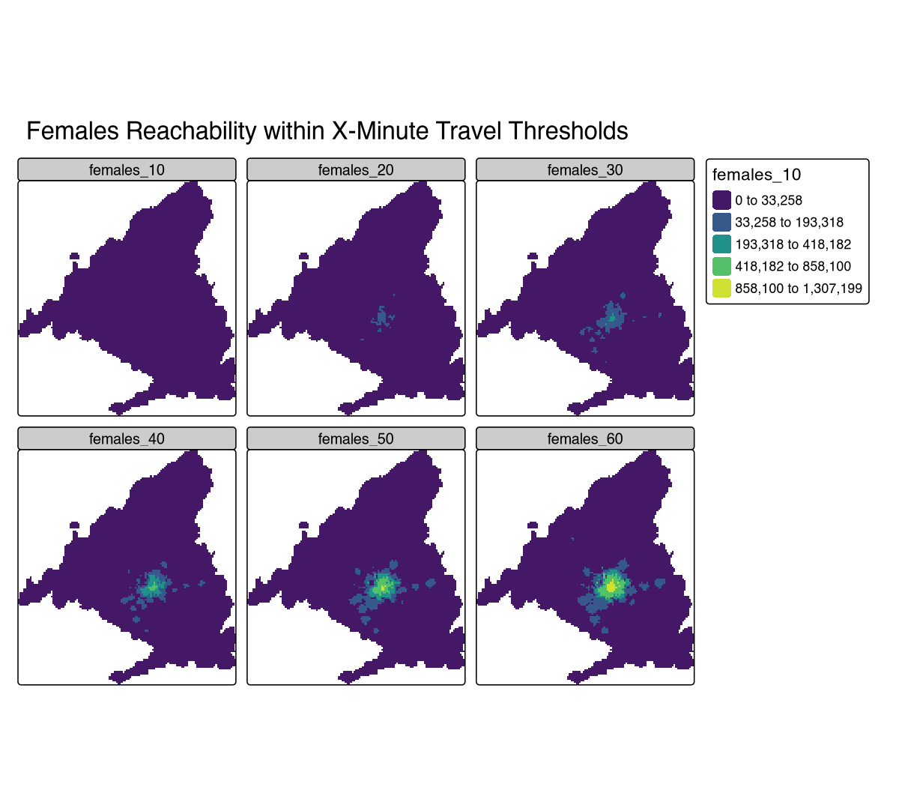

This repository contains the code to reproduce the accessibility
analysis for Madrid functional urban area (FUA).

Accessibility is measured as the number of people (total, males or
females) that can reach a given location within X minutes by public
transport. See the plots below for the results.





Data sources used in the analysis:

# Reproduce

## Reproducing with locally installed `R`

Before proceeding with the steps make sure the computational environment
is set up correctly.

- Install R 4.5.0 or later.

- Clone the repository or download it manually and unpack.

``` bash
git clone https://github.com/e-kotov/acc-madrid-2025.git
```

- Run `R` or start `RStudio`/`Positron`/`VSCode` in the root directory
  of the project.

- Install packages with:

``` r
renv::restore(prompt = FALSE)
```

You can now run the pipeline with:

``` r
Sys.setenv(TAR_PROJECT = "main"); targets::tar_make()
```

This will download all the required data, run the analysis and produce
the output files in the `outputs` directory, namely:

- The final accessibility raster
  [`outputs/raster/acc_raster.tif`](outputs/raster/acc_raster.tif) with
  variables `total_`, `males_` and `females_` with suffixes indicating
  the threshold in minutes.

- THe visualizations of that raster in the
  [`outputs/plots`](outputs/plots) directory:

  - [`output/plots/main/reachability_total.png`](outputs/plots/main/reachability_total.png)

  - [`output/plots/main/reachability_females.png`](outputs/plots/main/reachability_females.png)

  - [`output/plots/main/reachability_males.png`](outputs/plots/main/reachability_males.png)

The overview of the pipeline is available in the `_targets_main.R` file,
and the visualization is below:


